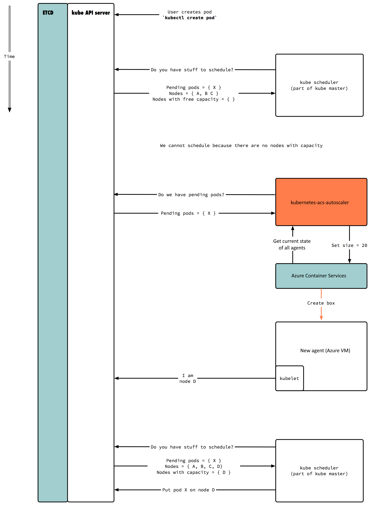

[](https://circleci.com/gh/wbuchwalter/Kubernetes-acs-engine-autoscaler)


:star2: This project is a fork of [OpenAI](https://openai.com/blog/)'s [Kubernetes-ec2-autoscaler](https://github.com/openai/kubernetes-ec2-autoscaler)  
 
:warning: **ACS is not supported, this autoscaler is for [`acs-engine`](https://github.com/azure/acs-engine) only**

:information_source: If you need autoscaling for VMSS, check out [OpenAI/kubernetes-ec2-autoscaler:azure](https://github.com/openai/kubernetes-ec2-autoscaler/tree/azure) or [cluster-autoscaler](https://github.com/kubernetes/contrib/tree/master/cluster-autoscaler)

# kubernetes-acs-engine-autoscaler

kubernetes-acs-engine-autoscaler is a node-level autoscaler for [Kubernetes](http://kubernetes.io/) for clusters created with acs-engine.  
Kubernetes is a container orchestration framework that schedules Docker containers on a cluster, and kubernetes-acs-autoscaler can scale based on the pending job queue.

## Architecture



## Setup

The autoscaler can be run anywhere as long as it can access the Azure
and Kubernetes APIs, but the recommended way is to set it up as a
Kubernetes Pod.

### Credentials

You need to provide a Service Principal to the autoscaler and your subscription id.
You can create a service principal using [Azure CLI](https://github.com/Azure/azure-cli):  
`az ad sp create-for-rbac`

You also need to provide the `clientPrivateKey` and `caPrivateKey`. You can find these values in the `azuredeploy.parameters.json` that you generated by `acs-engine`.
For cluster created with acs-engine >= 0.12.0 you will also need to provide `etcdClientPrivateKey` and `etcdServerPrivateKey`.

### Installing the autoscaler

The simplest way to install the autoscaler is using [Helm](helm.sh).
Fill in the values in [`values.yaml`](./helm-chart/values.yaml) and then install the chart with:
```bash
helm install helm-chart
```

If you created your cluster with acs-engine >= 0.12.0 `rbac.install` need to be set to true.


> NOTE: If you provided a custom deployment name when deploying the kubernetes cluster, You need to provide this value in `values.yaml` to `acsdeployment`. Otherwise, it will look for the default `azuredeploy` deployment.

You should then be able to inspect the pod's status and logs:
```
$ kubectl get pods -l app=autoscaler
NAME               READY     STATUS    RESTARTS   AGE
autoscaler-opnax   1/1       Running   0          3s

$ kubectl logs autoscaler-opnax 
2016-08-25 20:36:45,985 - autoscaler.cluster - DEBUG - Using kube service account
2016-08-25 20:36:45,987 - autoscaler.cluster - INFO - ++++++++++++++ Running Scaling Loop ++++++++++++++++
2016-08-25 20:37:04,221 - autoscaler.cluster - INFO - ++++++++++++++ Scaling Up Begins ++++++++++++++++
...
```

### Running locally
```
$ docker build -t autoscaler .
$ ./devenvh.sh
#in the container
$ python main.py --resource-group k8s --service-principal-app-id 'XXXXXXXXX' --service-principal-secret 'XXXXXXXXXXXXX' service-principal-tenant-id 'XXXXXX' -vvv --kubeconfig /root/.kube/config --kubeconfig-private-key 'XXXX' --client-private-key 'XXXX'
```

## Full List of Options

```
$ python main.py [options]
```
- --resource-group: Name of the resource group containing the cluster
- --kubeconfig: Path to kubeconfig YAML file. Leave blank if running in Kubernetes to use [service account](http://kubernetes.io/docs/user-guide/service-accounts/).
- --service-principal-app-id: Azure service principal id. Can also be specified in environment variable `AZURE_SP_APP_ID`
- --service-principal-secret: Azure service principal secret. Can also be specified in environment variable `AZURE_SP_SECRET`
- --service-principal-tenant-id: Azure service princiap tenant id. Can also be specified in environment variable `AZURE_SP_TENANT_ID`
- --subscription-id: Azure subscription id
- --client-private-key: The value of `clientPrivateKey` parameter in your `azuredeploy.parameters.json` generated with `acs-engine`
- --ca-private-key: The value of`caPrivateKey` parameter in your `azuredeploy.parameters.json` generated with `acs-engine`
- --sleep: Time (in seconds) to sleep between scaling loops (to be careful not to run into AWS API limits)
- --slack-hook: Optional [Slack incoming webhook](https://api.slack.com/incoming-webhooks) for scaling notifications
- --dry-run: Flag for testing so resources aren't actually modified. Actions will instead be logged only.
- -v: Sets the verbosity. Specify multiple times for more log output, e.g. `-vvv`
- --debug: Do not catch errors. Explicitly crash instead.
- --ignore-pools: Names of the pools that the autoscaler should ignore, separated by a comma.
- --spare-agents: Number of agent per pool that should always stay up (default is 1)
- --acs-deployment: The name of the deployment used to deploy the kubernetes cluster initially
- --idle-threshold: Maximum duration (in seconds) an agent can stay idle before being deleted
- --over-provision: Number of extra agents to create when scaling up, default to 0.

## Windows Machine Pools

Currently node pools with Windows machines are not supported. If a Windows pool is part of the deployment the autoscaler will fail even for scaling Linux-based node pools.
